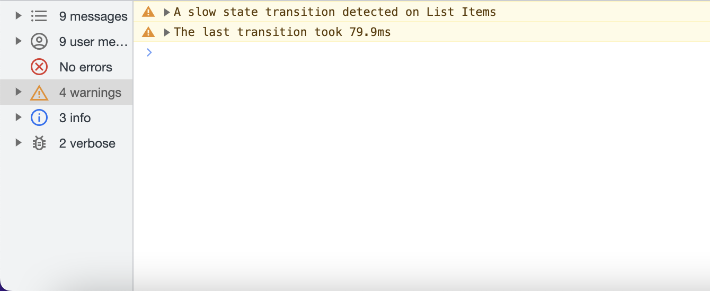

# Enhanced Stores
An extension of Svelte's `store` API's that support the usage of middleware enhancers! 

# Getting Started

## Installation
```bash
npm install --save @figliolia/enhanced-stores
# or
yarn add @figliolia/enhanced-stores
```

## Background 
Svelte Stores are a great way to manage isolated slices of state in your Svelte projects. Their only shortcoming is that they lack some of the convenient API's of more seasoned state management libraries such as Redux, MobX, and *__insert library here__*. 

This library is designed to allow developers to polyfill their own features into their Svelte stores through a familiar middleware API.

This library wraps each stores provided by Svelte and **fully** implements their API's. 

This means, you can drop in this library anywhere you're currently using `Svelte` stores - with no refactoring required!

## Basic Usage
To begin using and creating middleware for your Svelte stores, simply import an `EnhancedWritable`, `EnhancedReadable`, or `EnhancedDerived`. Each of these instances work identically to `Svelte` stores and support `get()` and `$value` syntax:

#### Creating Stores

##### `EnhancedWriteable`
The `EnhancedWritable` is a `writable` instance that exposes a `registerMiddleware` method
```typescript
import { EnhancedWritable } from "@figliolia/enhanced-stores";

const listItems = new EnhancedWritable("List Items", [1, 2, 3]);
/* 
  Enhanced Stores require a string as their first parameter

  This string represents a name for this piece of state and 
  is used to identify specific stores from within your middleware

  The parameters following the name are identical to Svelte's writable
*/

listItems.set([1, 2, 3, 4]);
listItems.update(v => [...v, 4]);
listItems.subscribe((v) => {});
listItems.registerMiddleware(/* ...middleware */);

$listItems // [1, 2, 3, 4]
get(listItems) // [1, 2, 3, 4]
```

##### `EnhancedDerived`
The `EnhancedDerived` is a `derived` instance that exposes a `registerMiddleware` method
```typescript
import { 
  EnhancedDerived,
  EnhancedWritable, 
} from "@figliolia/enhanced-stores";

const base = new EnhancedWritable("Base Items", [1, 2, 3]);
// Create a derived instance from an EnhancedWritable or Svelte writable
const listItems = new EnhancedDerived(
  "List Items",
  base, 
  (v) => v.map(el => el + 1)
);

listItems.subscribe((v) => {});
listItems.registerMiddleware(/* ...middleware */);

$listItems // [2, 3, 4]
get(listItems) // [2, 3, 4]
```

##### `EnhancedReadable`
The `EnhancedReadable` is a `readable` instance that exposes a `registerMiddleware` method
```typescript
import { EnhancedReadable } from "@figliolia/enhanced-stores";

const time = new EnhancedWritable("Time", Date.now(), set => {
  const interval = setInterval(() => {
    set(Date.now());
  }, 1000);
 
  return function stop() {
    clearInterval(interval);
  };
});

listItems.subscribe((v) => {});
listItems.registerMiddleware(/* ...middleware */);

$listItems // Unix time stamp
get(listItems) // Unix time stamp
```

## Using Middleware
The primary purpose of this library and the stores it exposes is for creating enhancements to the default behavior of Svelte stores.

Let's look at some useful examples


### Logging Middleware 
This library comes with a redux-like logging middleware for your stores. To enable it, import the `Logger` and one of the `Enhanced*` stores:

```typescript
import { EnhancedWritable, Logger } from "@figliolia/enhanced-stores";

const ListItems = new EnhancedWritable("List Items", [1, 2, 3]);

if(process.env.NODE_ENV === "development") {
  // Enable logging!
  ListItems.registerMiddleware(new Logger());
}

// Set state using `set` or `update`
ListItems.set([1, 2, 3, 4]);
// or
ListItems.update(v => [...v, 4]);
```
Just like that, you now have a history of your `writable's` state updates in your console during development mode.


#### Profiling Middleware
In addition to logging, this library comes with one of my more favored middlewares - a profiler for inefficient state updates. This middleware, will issue a warning to the console anytime it detects a bottleneck in one of your stores:

```typescript
import { EnhancedWritable, Profiler } from "@figliolia/enhanced-stores";

const ListItems = new EnhancedWritable("List Items", [1, 2, 3]);

if(process.env.NODE_ENV === "development") {
	// Enable profiling!
  ListItems.registerMiddleware(new Profiler());
}

// Set state 
ListItems.update(v => {
  // intentional bottleneck
  for(let i = 0; i < 100000000; i++) {};
  return [...v, 4];
});
```
When bottlenecks are identified in your `writable` or `derived` state updates, you'll receive warnings like this one:



### Building Your Own Middleware
To build your own middleware, simply extend the `Middleware` class provided by this library and override its methods:

```typescript
import { Middleware } from "@figliolia/enhanced-stores";

class MyMiddleware<T> extends Middleware<T> {
  public override onInitialize(name: string, state: T) {
    // Execute logic on initialization of a store
  }
  public override onBeforeUpdate(name: string, state: T) {
    // Execute logic before updates take place
  }

  public override onUpdate(name: string, state: T) {
    // Execute logic after state updates
  }
} 
```
Each method found above receives the name of the `writable`, `readable`, or `derived` store along with its current value.

#### A Real World Example - Profiling
To better demonstrate how to build useful tools using the middleware API, let's build the `Profiling Middleware` found in this library:

```typescript
import { Middleware } from "@figliolia/enhanced-stores";

// Extend the Base class
export class Profiler<T> extends Middleware<T> {
  public threshold: number;
  private lastUpdate: number | null = null;
	// Accept a threshold parameter
  constructor(threshold: number = 16) {
    this.threshold = threshold;
  }
  // Capture a high-res timestamp before each update
  public override onBeforeUpdate(name: string, state: T) {
    this.lastUpdate = performance.now();
  }

  // Compare the current high-res timestamp with the previous
  public override onUpdate(name: string, state: T) {
    if(performance.now() - this.lastUpdate > this.threshold) {
      // Issue a warning if a state update exceeds the threshold
      console.warn("Slow state update detected on", name);
    }
  }
} 
```

#### A Real World Example - Testing
Testing stores using their update history can be a meaningful way to ensure that certain side-effects occur in your test cases. Let's create a middleware that tracks each update to your stores and provides a means for making assertions:

```typescript
import { Middleware } from "@figliolia/enhanced-stores";

// Extend the Base class
export class Testing<T> extends Middleware<T> {
  public history: T[] = [];

  // Push the initial value to the history array
  public override onInitialization(name: string, state: T) {
    this.history.push(state);
  }

  // Push each state update to the history array
  public override onUpdate(name: string, state: T) {
    this.history.push(state);
  }

  // Expose a method for asserting that the store's
  // update history matches the input
  public assert(history: T[]) {
    const { length } = this.history;
    for(let i = 0; i < length; i++) {
      if(this.history[i] !== history[i]) {
        return false;
      }
    }
    return true;
  }
} 
```

Simply register this middleware on your stores in testing environments and make assertions based on the store's update history

## Factories
In your application, you may find yourself registering the same middleware to each new store you create. To reduce the amount of boiler plate required to enhance your stores, this library comes with an `EnhancerFactory`.

Enhancer Factories are factories that are constructed with one or more middleware. From your factories, you can spawn, `readable`, `writable`, and `derived` stores with your middleware already registered to them:

```typescript
import { EnhancerFactory, Logger, Profiler } from "@figliolia/enhanced-stores";

const Factory = new EnhancerFactory(
  new Logger(), 
  new Profiler()
  // ...and so on
);

const writable = Factory.createWritable(/* enhanced store arguments*/);
const derived = Factory.createDerived(/* enhanced derived arguments*/);
const readable = Factory.createReadable(/* enhanced readable arguments*/);
```
Each of the `create` methods found on the `Factory` will return an `enhanced` readable, writable, or derived instance with the `Logger` and `Profiler` registered to it.

## Contributing
This library was built with the intention of adding some useful mechanisms for extending the behavior of Svelte stores. It's designed to help Svelte Stores reach some feature-parity with popular state management tools that have become prolific in the frontend world.

If you see identify a bug or a better way of achieving this, your contributions and welcome and supported.